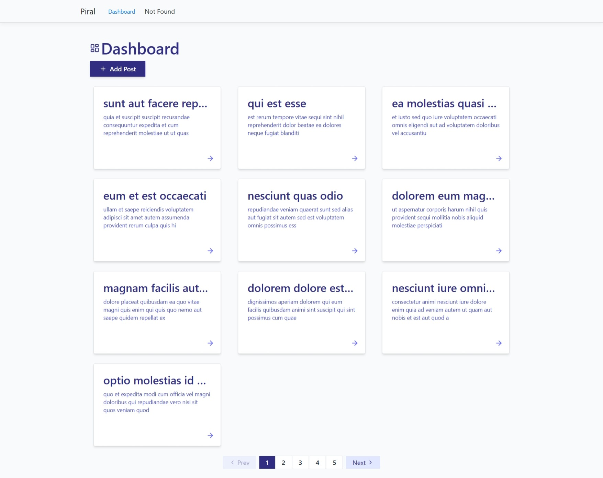

# Dashboard Pilet


A modular **React + TypeScript + Piral** microfrontend (pilet) that provides a functional **dashboard interface**.  
This dashboard fetches posts from the **JSONPlaceholder API**, allows adding new posts locally (persisted with Zustand), supports pagination, modal previews, and detailed views — all styled beautifully with **TailwindCSS**, making use of **Lucide React icons**, and animated via **Framer Motion**.

---

## 📚 Table of Contents
- [Features](#features)
- [Tech Stack](#tech-stack)
- [Setup & Installation](#setup--installation)
- [Running Tests](#running-tests)
- [Navigation](#navigation)
- [Build & Output](#build--output)
- [License](#license)
- [Author](#author)


## Features

* **Dynamic Posts Dashboard**
- Fetches paginated posts (10 per page) from JSONPlaceholder.
- Displays posts using reusable `ItemCard` and `ItemList` components.

* **Add Post (Local + Optimistic UI)**
- Add new posts locally via a modal form.
- Newly added posts appear instantly at the top of the list.
- Local posts are persisted with Zustand.

* **Post Details**
- View detailed post content on `/dashboard/:id`.
- Fetches data from Zustand store (not directly from API).

* **Reusable Components**
- `AddItemForm`, `AddPostButton`, `Pagination`, and `InputField`.

* **Modern UI & UX**
- TailwindCSS for rapid styling.
- Theme system via CSS `@theme` block for shared colors.
- Framer Motion for fluid animations.
- Lucide React icons for consistent icons.

* **State Management**
- Centralized store using **Zustand**.
- Local persistence with `zustand/middleware` (`persist`).

* **Testing**
- Comprehensive Jest + React Testing Library setup for component testing.

---
# Dashboard

---

## Tech Stack

| Technology | Purpose |
|-------------|----------|
| **React (TypeScript)** | UI & logic |
| **Vite** | Fast bundling & development |
| **Piral (Pilet)** | Microfrontend architecture |
| **Zustand** | Global state & persistence |
| **Axios** | API communication |
| **TailwindCSS** | Styling |
| **Framer Motion** | Animation |
| **Jest + React Testing Library** | Unit & component testing |

---

## Setup & Installation

This pilet can run **standalone locally** or be integrated into a **Piral shell**.

### 1. Clone the repository

```bash
git clone https://github.com/davistar21/dashboard-pilet.git
cd dashboard-pilet
```
### 2. Install dependencies
```bash
npm install
```
### 3. Run the development server
```bash
npm run dev
```
The local server will start on: 
```bash
http://localhost:1234/ 
```
--- 

## Running Tests
This project uses **Jest** and **React Testing Library**.
Run all tests with: 
```bash
npm run test
```
---

## Navigation
| Route            | Description                                 |
| ---------------- | ------------------------------------------- |
| `/dashboard`     | Main dashboard page showing paginated posts |
| `/dashboard/:id` | Displays post detail view                   |

--- 

## Build & Output
Build the pilet with:
```bash
npm run build
```
Output will be available in:
```bash
/dist
```
If integrating into a Piral instance:

Copy the `.tgz` file or link it using `pilet debug`.

Register it in your Piral shell for `/dashboard`.
---
## License
This project is licensed under the MIT License.
---
## Author
Eyitayo Obembe